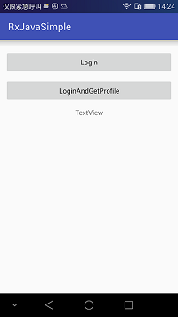
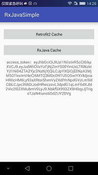

## Retrofit2RxJava-Android-Simples
Retrofit2 + Rxjava +Cache 机制+EventBus，新增Token失效处理方案，mobile network 情况下缓存一分钟过期重新请求，wifi 情况下不使用缓存，none network 情况下直接读取缓存并离线缓存4周。

   


### Http解耦

> **请求**

```
HttpImpl.getInstance().getProfiles(mAccessToken);
```

> **处理**

```
@Override
public void onEventMainThread(Object event) {
    super.onEventMainThread(event);
    hideProgressDialog();
    if (event instanceof Token) {
        Token token = (Token) event;
        mAccessToken = token.getAccess_token();
        PreferenceUtils.setPrefString(RxApplication.getInstance(), 
                PreferenceConstants.REFRESH_TOKEN, token.getRefresh_token());
        Toast.makeText(LoginActivity.this, "登录成功！", Toast.LENGTH_SHORT).show();
        Intent intent = new Intent().setClass(LoginActivity.this, MainActivity.class);
        intent.putExtra("accessToken", mAccessToken);
        startActivity(intent);
    }
    if (event instanceof FailedEvent) {
        int type = ((FailedEvent) event).getType();
        switch (type) {
            case MessageType.LOGIN:
                Toast.makeText(this, "登录失败！", Toast.LENGTH_SHORT).show();
                break;
        }
    }
}
```


### 网络缓存机制

      private final static Interceptor REWRITE_CACHE_CONTROL_INTERCEPTOR = new Interceptor() {
        @Override
        public Response intercept(Chain chain) throws IOException {
            Request request = chain.request();
            //获取网络状态
            int netWorkState = NetUtils.getNetworkState(RxApplication.getInstance());
            //无网络，请求强制使用缓存
            if (netWorkState == NetUtils.NETWORN_NONE) {
                request = request.newBuilder()
                        .cacheControl(CacheControl.FORCE_CACHE)
                        .build();
            }
    
            Response originalResponse = chain.proceed(request);
    
            switch (netWorkState) {
                case NetUtils.NETWORN_MOBILE://mobile network 情况下缓存一分钟
                    int maxAge = 60;
                    return originalResponse.newBuilder()
                            .removeHeader("Pragma")
                            .removeHeader("Cache-Control")
                            .header("Cache-Control", "public, max-age=" + maxAge)
                            .build();
    
                case NetUtils.NETWORN_WIFI://wifi network 情况下不使用缓存
                    maxAge = 0;
                    return originalResponse.newBuilder()
                            .removeHeader("Pragma")
                            .removeHeader("Cache-Control")
                            .header("Cache-Control", "public, max-age=" + maxAge)
                            .build();
    
                case NetUtils.NETWORN_NONE://none network 情况下离线缓存4周
                    int maxStale = 60 * 60 * 24 * 4 * 7;
                    return originalResponse.newBuilder()
                            .removeHeader("Pragma")
                            .removeHeader("Cache-Control")
                            .header("Cache-Control", "public, only-if-cached, max-stale=" + maxStale)
                            .build();
                default:
                    throw new IllegalStateException("network state  is Erro!");
            }
        }
    };

### Token过期处理机制

    public class TokenAuthenticator implements Authenticator {
      @Override
      public Request authenticate(Route route, Response response) throws IOException {
          //取出本地的refreshToken
          String refreshToken = PreferenceUtils.getPrefString(RxApplication.getInstance(),"refreshToken","");
          RefreshRequest refreshRequest = new RefreshRequest(refreshToken);
          // 通过一个特定的接口获取新的token，此处要用到同步的retrofit请求
          ServiceApi service = ServiceFactory.createRetrofit2(ServiceApi.class);
          Call<Token> call = service.refresh(refreshRequest);
    
         //要用retrofit的同步方式
          Token token = call.execute().body();
          PreferenceUtils.setPrefString(RxApplication.getInstance(),"refreshToken",token.getRefresh_token());
    
          return response.request().newBuilder()
                  .header("X-ZUMO-AUTH", token.getAccess_token())
                  .build();
       }
    }

### Unsupported major.minor version 52.0 问题解决方案

http://stackoverflow.com/questions/36008207/how-to-run-android-code-in-eclipse

To fix this, i have to go in my project.properties file，
And in this file add this line : sdk.buildtools=23.0.2


#### Android Studio中ButterKnife插件的安装与使用


http://blog.csdn.net/cxc19890214/article/details/47430547


### 推荐书籍

Think in java

Effective java

Clean code


### 参考

https://github.com/cheng2016/RxJava-Android-Samples

https://github.com/cheng2016/RxJava

### Contact Me

- Github: github.com/cheng2016
- Email: mitnick.cheng@outlook.com
- QQ: 1102743539